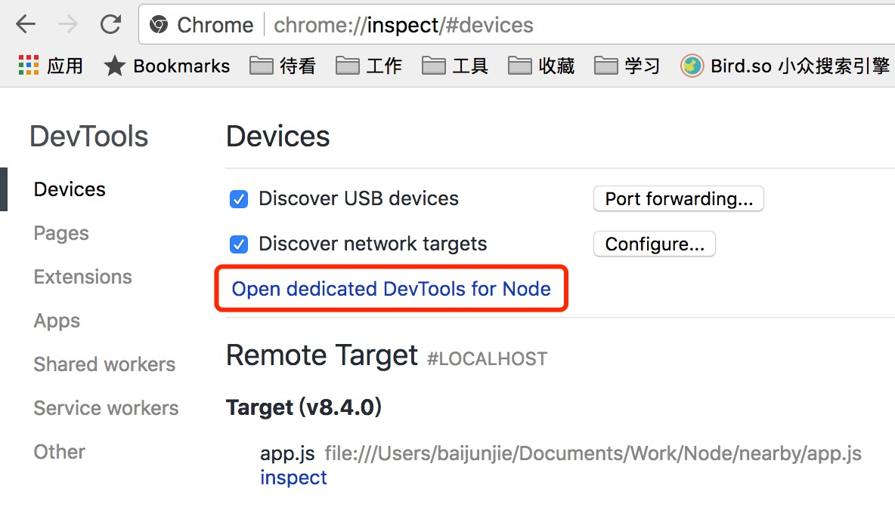

# Chrome 调试 Node

### 基本调试nodejs

要执行 `app.js` 这个脚本，在命令行中输入 

````
$ node --inspect app.js
````

然后在chrome浏览器中输入 

```
chrome://inspect
```

接着点击 `Open dedicated DevTools for Node`
如图： 



接着就会弹出一个新的窗口，叫 `Developer tools - Node.js`

然后就跟调试普通 js 一样了

### 注意点

如果nodejs程序是一下子就跑完的，那你需要下面的参数，用来在开头就暂停住程序，就好像在第一行给程序打了断点 

```
$ node --inspect-brk 1.js
```

### Typescript 编写的 nodejs

编译 Typescript 的时候，加上 `–sourceMap`，然后其他同上

### 版本要求

nodejs 要求 6.6+ 
chrome 要求 55+

